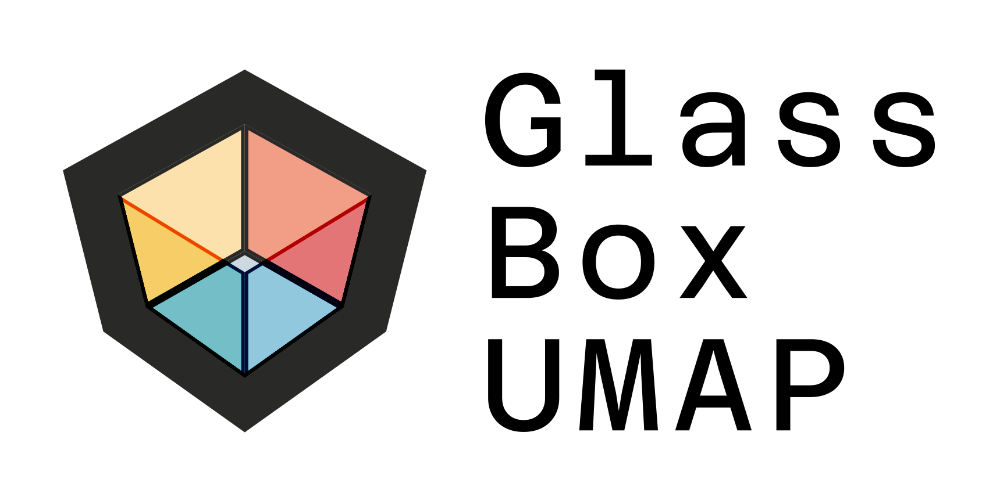

# Glass Box UMAP

Glass Box UMAP augments UMAP by computing exact feature contributions to the UMAP embedding.

Standard UMAP produces embeddings but offers no insight into why points land where they do. Glass Box UMAP solves this by using a specially designed neural network that enables exact computation of feature contributions, and does so without approximations. The feature contributions are mathematically exact, validated to near machine precision.

# Documentation

All resources are hosted at [https://glass-box-umap.readthedocs.io](https://glass-box-umap.readthedocs.io).

**Quick links**:

1. [**Installation**](https://glass-box-umap.readthedocs.io/en/latest/user_guide/install.html)
1. [Basic usage](https://glass-box-umap.readthedocs.io/en/latest/user_guide/basic_usage.html)
1. [Citation](https://glass-box-umap.readthedocs.io/en/latest/meta/citation.html)

# Acknowledgements

* Thank you to Leland McInnes, Tim Sainburg, Timothy Gentner, and Francois Chollet for their work on [parametric UMAP](https://arxiv.org/abs/2009.12981). Special thanks to Leland McInnes for maintaining [umap-learn](https://umap-learn.readthedocs.io/en/latest/), and all other contributors, whose work has made this project possible.
* Glass Box UMAP is part of [Arcadia Science's](https://www.arcadiascience.com/) commitment to open, reproducible research tools.
